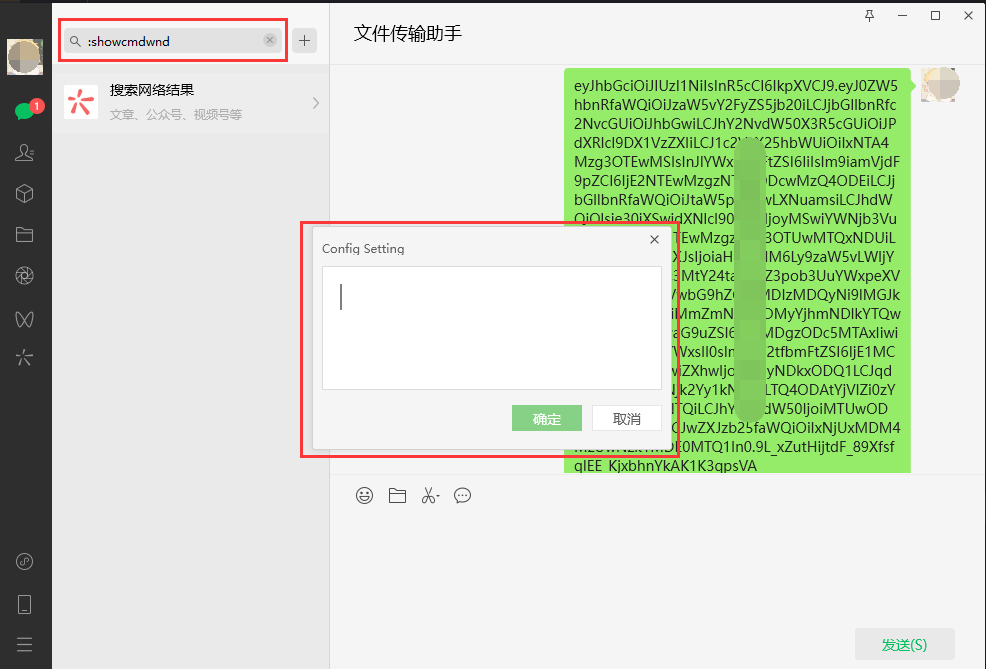

# RadiumWMPFInstaller

> 适合在使用微信浏览器或微信小程序出现异常情况的时候 <br/>
> 重新安装 `RadiumWMPF` <br/>
> 可以对微信浏览器组件进行升级或降级

## 安装

```bash
pip install RadiumWMPFInstaller
```

## 使用方法

- 先打开并登录微信
- 使用管理员启动一个终端，执行以下命令

```bash
RadiumWMPFInstaller
```

- 选择要安装的版本，会显示对应的指令

### 如何使用指令

- 打开微信主面板 按 `CTRL+F` 或点击搜索


- 输入 `:showcmdwnd`，会弹出 `Config Setting` 对话框



- 将输出的指令填进去后点击确定


- 切记：这里要等待出现对话框后再重启微信


### 也可能会有错误情况，重新执行脚本即可


### 降低客户端版本

- 如果没找到想安装的 `RadiumWMPF` 版本，可以 
[安装旧版本客户端](https://github.com/tom-snow/wechat-windows-versions/releases)


- **卸载现有版本记得勾选上保留数据，防止聊天记录丢失**

